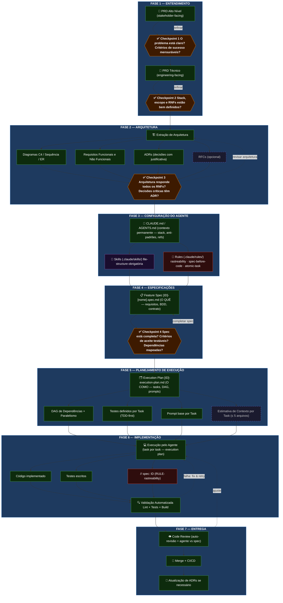
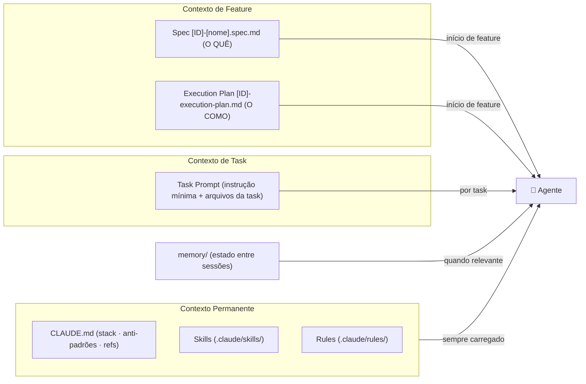

# AI-Assisted Software Development Flow

> Metodologia para desenvolvimento de software com IA — Solo Dev + AI Agent
> Versão: 1.1 | Data: 2026-03-28

---

## Diagrama do Fluxo

---

## Separação de Responsabilidades por Artefato

| Artefato | Responde a | Não contém |
| --- | --- | --- |
| **CLAUDE.md** | Padrões permanentes (stack, anti-padrões, refs a skills/rules) | Requisitos de feature, lógica de negócio |
| **Skill** `file-structure` | Naming, estrutura de pastas, padrão arquitetural | Requisitos, constraints globais |
| **Rule** | Constraint sempre ativa (rastreability, spec-before-code...) | Instruções situacionais |
| **PRD Técnico** | Requisitos do sistema (RF, RNF, arquitetura) | Tasks, planos de execução |
| **ADR** | Decisão arquitetural com trade-offs | Instruções de implementação |
| **Spec** | O QUÊ implementar (requisitos, BDD, contrato) | COMO implementar, tasks, padrões de stack |
| **Execution Plan** | O COMO executar (tasks, DAG, prompts base) | Requisitos, critérios de aceite |

---

## Escala do Projeto

O fluxo é **escalável**. Para projetos pequenos, algumas etapas são opcionais:

| Etapa | Projeto Pequeno | Projeto Médio | Projeto Grande |
| --- | --- | --- | --- |
| PRD Alto Nível | Opcional | ✅ | ✅ |
| PRD Técnico | ✅ Simplificado | ✅ | ✅ Completo |
| Diagramas | Opcional | ✅ Principais | ✅ Todos |
| ADRs | 1–2 críticos | ✅ | ✅ Completo |
| RFCs | ❌ | Opcional | ✅ |
| CLAUDE.md | ✅ Essencial | ✅ | ✅ |
| Skill `file-structure` | ✅ Essencial | ✅ | ✅ Completa |
| Rules base | ✅ 3 padrões | ✅ | ✅ Customizadas |
| Specs | ✅ Por feature | ✅ | ✅ |
| Execution Plan | ✅ Simplificado | ✅ | ✅ Completo |
| CI/CD | Básico | ✅ | ✅ Completo |

---

## Fluxo de Contexto do Agente

**Regra de ouro para economizar tokens:**

| Camada | O que contém | Quando carregar |
| --- | --- | --- |
| `CLAUDE.md` + Skills + Rules | Sempre válido — stack, padrões, constraints | Toda sessão (automático) |
| `Spec` | Válido para esta feature — O QUÊ | Início da feature |
| `Execution Plan` | Válido para esta feature — O COMO | Início da feature |
| `Task Prompt` | Instrução mínima + arquivos desta task | Por task |
| `memory/` | Estado que deve persistir entre sessões | Quando relevante |

> **Sinal de contexto degradado:** agente faz perguntas já respondidas na spec, repete código
> escrito ou ignora uma rule. Ação: nova sessão com CLAUDE.md + spec + execution plan.
