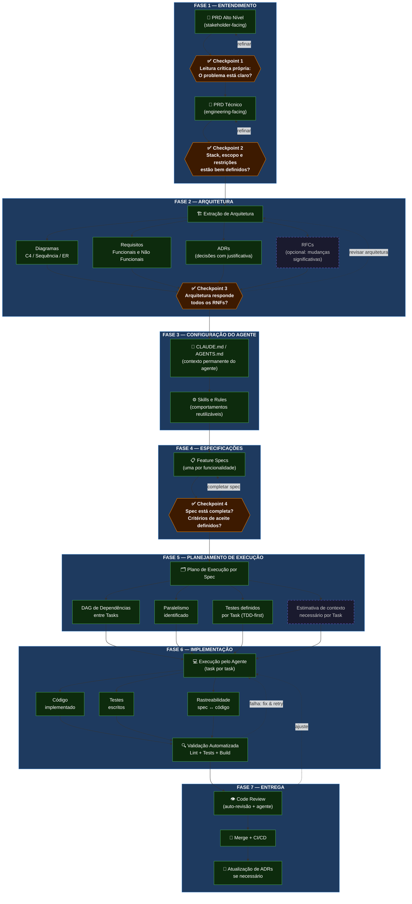
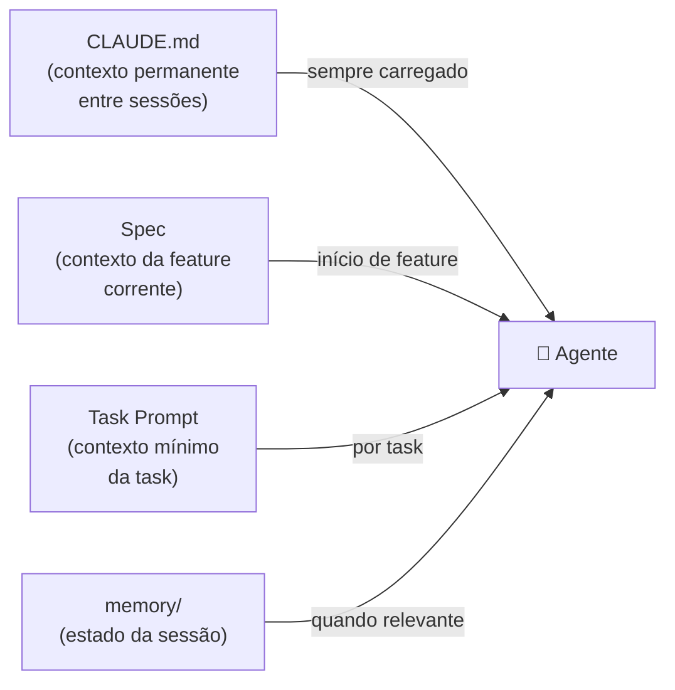

# AI-Assisted Software Development Flow

> Metodologia para desenvolvimento de software com IA — Solo Dev + AI Agent
> Versão: 1.0 | Data: 2026-03-28

---

## Diagrama do Fluxo

---

## Escala do Projeto

O fluxo é **escalável**. Para projetos pequenos, algumas etapas são opcionais:

| Etapa | Projeto Pequeno | Projeto Médio | Projeto Grande |
| --- | --- | --- | --- |
| PRD Alto Nível | Opcional | ✅ | ✅ |
| PRD Técnico | ✅ Simplificado | ✅ | ✅ Completo |
| Diagramas | Opcional | ✅ Principais | ✅ Todos |
| ADRs | 1–2 decisões críticas | ✅ | ✅ Completo |
| RFCs | ❌ | Opcional | ✅ |
| CLAUDE.md | ✅ Essencial | ✅ | ✅ |
| Skills e Rules | Reutilizar existentes | ✅ | ✅ Customizadas |
| Specs | ✅ Por feature | ✅ | ✅ |
| CI/CD | Básico | ✅ | ✅ Completo |

---

## Fluxo de Contexto do Agente

**Regra de ouro para economizar tokens:**

- `CLAUDE.md` = o que **sempre** vale → stack, padrões, anti-padrões, estrutura de pastas
- `Spec` = o que vale **para a feature** → requisitos, aceite, dependências
- `Task prompt` = o que vale **para essa task** → instrução objetiva, contexto mínimo
- `memory/` = decisões e estado que precisam **persistir entre sessões**
