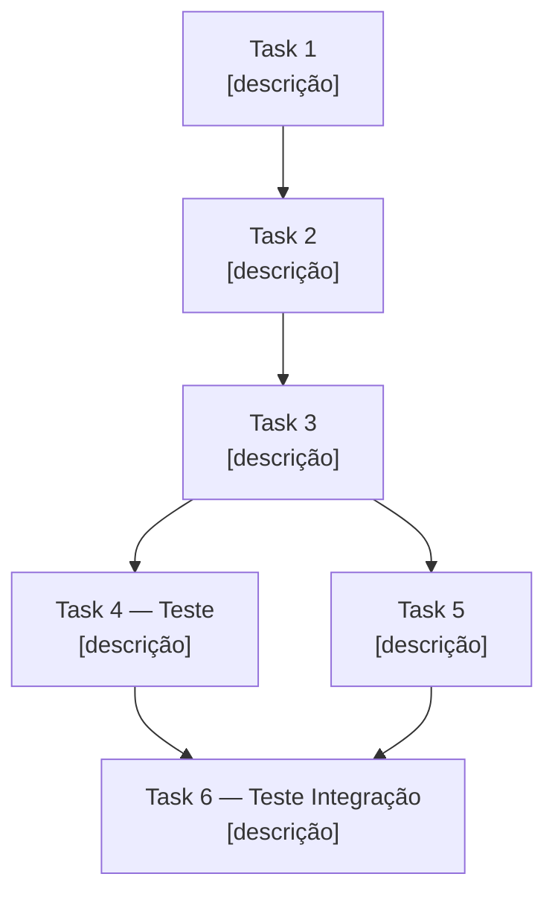

# Execution Plan: [ID] — [Nome da Feature]

> **Spec:** `docs/specs/[ID]-[nome].spec.md`
> **Status:** [Rascunho | Pronto para Execução | Em Andamento | Concluído]
> **Data:** YYYY-MM-DD
> **Contexto do agente:** CLAUDE.md + spec acima + este arquivo

---

## Arquivos a Criar / Modificar

> Naming, localização e arquitetura: seguir **skill: file-structure** do projeto.

| Ação | Arquivo | Responsabilidade |
|---|---|---|
| Criar | [caminho] | [o que este arquivo faz] |
| Criar | [caminho.spec.ts] | Testes dos cenários BDD da spec |
| Modificar | [caminho] | [o que muda e por quê] |

---

## DAG de Tasks

> Mapa de dependências. Tasks sem dependência podem rodar em paralelo.



---

## Tasks

> Uma task = um arquivo ou uma responsabilidade (ver RULE-atomic-task).
> Contexto mínimo por task: spec + arquivos listados em "Depende de ler".

### Task 1 — [Nome]

**Descrição:** [O que deve ser feito de forma objetiva]
**Arquivo(s):** `[caminho do arquivo]`
**Depende de (tasks):** —
**Depende de ler:** `[arquivo que o agente precisa ter como contexto]`
**Critério de conclusão:** [Como saber que está pronto]

---

### Task 2 — [Nome]

**Descrição:** [O que deve ser feito]
**Arquivo(s):** `[caminho]`
**Depende de (tasks):** Task 1
**Depende de ler:** `[arquivo]`, `[arquivo]`
**Critério de conclusão:** [Como saber que está pronto]

---

### Task 3 — [Nome]

**Descrição:** [O que deve ser feito]
**Arquivo(s):** `[caminho]`
**Depende de (tasks):** Task 2
**Depende de ler:** `[arquivo]`
**Critério de conclusão:** [Como saber que está pronto]

---

### Task 4 — Testes Unitários [Módulo]

**Descrição:** Escrever testes unitários cobrindo os cenários BDD da spec (Cenários 1, 2, 3)
**Arquivo(s):** `[caminho.spec.ts]`
**Depende de (tasks):** Task 3
**Depende de ler:** `docs/specs/[ID]-[nome].spec.md` (seção Critérios de Aceite)
**Critério de conclusão:** Todos os cenários BDD da spec têm cobertura de teste passando

---

### Task 5 — [Nome] *(paralelo com Task 4)*

**Descrição:** [O que deve ser feito]
**Arquivo(s):** `[caminho]`
**Depende de (tasks):** Task 3
**Depende de ler:** `[arquivo]`
**Critério de conclusão:** [Como saber que está pronto]

---

### Task 6 — Teste de Integração

**Descrição:** Escrever teste de integração cobrindo o fluxo completo do endpoint/feature
**Arquivo(s):** `[caminho.integration.spec.ts]`
**Depende de (tasks):** Task 4, Task 5
**Depende de ler:** `docs/specs/[ID]-[nome].spec.md` (seção Contrato de Interface)
**Critério de conclusão:** Teste rodando contra infraestrutura real (banco, serviços)

---

## Estimativa de Contexto por Task

> Mapeamento de quantos arquivos o agente precisa ler por task.
> Se > 5 arquivos → quebrar a task em partes menores.

| Task | Arquivos de contexto | Qtde | OK? |
|---|---|---|---|
| Task 1 | CLAUDE.md, skill:file-structure | 2 | ✅ |
| Task 2 | CLAUDE.md, Task1-output, spec | 3 | ✅ |
| Task 3 | CLAUDE.md, Task2-output, ADR-NNN | 3 | ✅ |
| Task 4 | CLAUDE.md, spec (BDD), Task3-output | 3 | ✅ |
| Task 5 | CLAUDE.md, Task3-output, spec | 3 | ✅ |
| Task 6 | CLAUDE.md, spec (contrato), Tasks 4+5 | 4 | ✅ |

---

## Prompt Base por Task

> Template de prompt para iniciar cada task com o agente.
> Copiar e ajustar conforme necessário.

```
Contexto: projeto [nome], spec [ID].
Leia: CLAUDE.md (já carregado) e docs/specs/[ID]-[nome].spec.md.

Task atual: [número e nome da task]
[Descrição objetiva do que fazer]
[Arquivo(s) a criar/modificar]

Critério de conclusão: [critério da task]
Não avance para próxima task sem minha confirmação.
```

---

## Status de Execução

> Atualizar durante a implementação.

| Task | Status | Notas |
|---|---|---|
| Task 1 | [ ] Pendente | |
| Task 2 | [ ] Pendente | |
| Task 3 | [ ] Pendente | |
| Task 4 | [ ] Pendente | |
| Task 5 | [ ] Pendente | |
| Task 6 | [ ] Pendente | |
