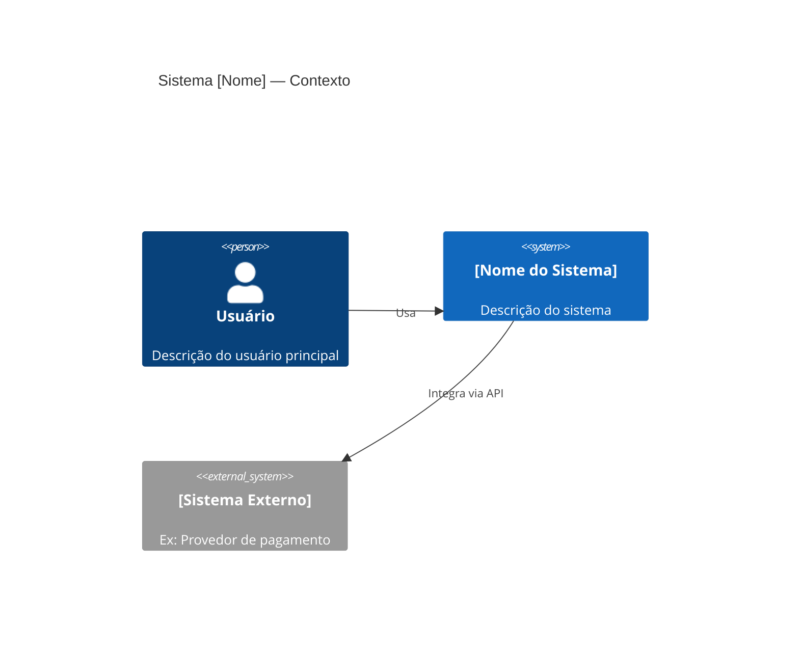
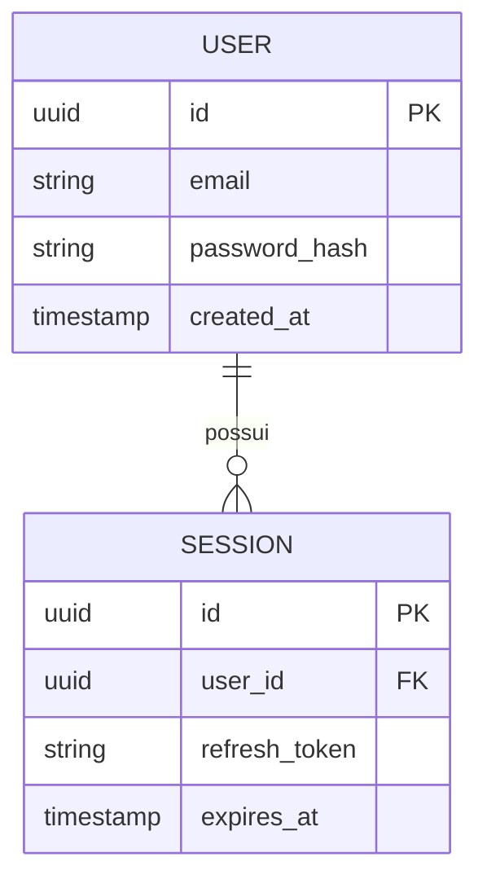

# PRD Técnico — [Nome do Projeto / Feature]

> **Versão:** 1.0
> **Data:** YYYY-MM-DD
> **Status:** [Rascunho / Em Revisão / Aprovado]
> **Autor:** [Nome]

---

## 1. Contexto e Motivação

### Problema

[Descreva o problema técnico ou de negócio que este projeto/feature resolve.
Seja específico: quem é afetado, qual é o impacto, por que agora.]

### Solução Proposta

[Descrição técnica de alto nível da solução. Não entre em detalhes de implementação aqui —
isso vai para a Arquitetura e Specs. Foco no "o quê", não no "como".]

### Objetivos

- [ ] [Objetivo mensurável 1]
- [ ] [Objetivo mensurável 2]

### Fora de Escopo

- [O que explicitamente NÃO será feito neste projeto]
- [Decisão tomada por quê? Referência ao ADR se houver]

---

## 2. Stack Tecnológica

| Camada | Tecnologia | Versão | Justificativa |
| --- | --- | --- | --- |
| [ex: Backend] | [ex: Node.js + NestJS] | [ex: 22 / 10] | [ex: ADR-001] |
| [ex: Frontend] | [ex: Next.js] | [ex: 14] | [ex: SSR necessário] |
| [ex: Banco] | [ex: PostgreSQL] | [ex: 16] | [ex: ADR-002] |
| [ex: Cache] | [ex: Redis] | [ex: 7] | [ex: session store] |
| [ex: Infra] | [ex: Vercel + Supabase] | — | [ex: custo/velocidade] |

---

## 3. Arquitetura de Alto Nível

### Diagrama de Contexto (C4 Nível 1)

### Principais Componentes

| Componente | Responsabilidade |
| --- | --- |
| [ex: API Gateway] | [ex: Roteamento, autenticação, rate limiting] |
| [ex: Auth Service] | [ex: Autenticação e autorização] |
| [ex: Core Service] | [ex: Lógica de negócio principal] |
| [ex: Database] | [ex: Persistência de dados] |

---

## 4. Requisitos Funcionais

> Formato: RF-NNN — [descrição observável do comportamento]

| ID | Requisito | Prioridade |
| --- | --- | --- |
| RF-001 | [O sistema deve permitir que usuários se cadastrem com e-mail e senha] | Alta |
| RF-002 | [O sistema deve enviar e-mail de confirmação após cadastro] | Alta |
| RF-003 | [O sistema deve permitir login com Google OAuth] | Média |

---

## 5. Requisitos Não Funcionais

### Performance

- [ ] [ex: API deve responder em < 200ms para 95% das requisições]
- [ ] [ex: Sistema deve suportar 1.000 usuários simultâneos]

### Segurança

- [ ] [ex: Senhas armazenadas com bcrypt (custo mínimo: 12)]
- [ ] [ex: Tokens JWT com expiração de 15 minutos]
- [ ] [ex: Rate limiting: máximo 10 tentativas de login por IP por minuto]

### Manutenibilidade

- [ ] [ex: Cobertura de testes mínima de 80% em serviços]
- [ ] [ex: Nenhuma função com mais de 30 linhas]
- [ ] [ex: Módulos desacoplados com interfaces bem definidas]

### Escalabilidade

- [ ] [ex: Stateless — sem estado em memória entre requisições]
- [ ] [ex: Cache de sessão via Redis (não em memória do processo)]

### Disponibilidade

- [ ] [ex: SLA de 99.5% de uptime]
- [ ] [ex: Graceful shutdown — sem perda de requests em andamento]

---

## 6. Integrações Externas

| Sistema | Tipo | Propósito | Autenticação |
| --- | --- | --- | --- |
| [ex: SendGrid] | [ex: REST API] | [ex: Envio de e-mails] | [ex: API Key] |
| [ex: Stripe] | [ex: SDK] | [ex: Processamento de pagamentos] | [ex: Secret Key] |

---

## 7. Modelo de Dados (Alto Nível)

> Detalhe do schema em `docs/architecture/diagrams/schema.md`

---

## 8. Restrições e Premissas

### Restrições

- [ex: Orçamento de infraestrutura máximo de $X/mês]
- [ex: LGPD — dados pessoais não podem sair do Brasil]
- [ex: Compatibilidade com Node.js LTS apenas]

### Premissas

- [ex: Usuários têm acesso a e-mail para confirmação de conta]
- [ex: Volume inicial estimado em 1.000 usuários nos primeiros 3 meses]

---

## 9. Critérios de Sucesso

| Critério | Métrica | Meta |
| --- | --- | --- |
| [ex: Performance] | [ex: P95 latência da API] | [ex: < 200ms] |
| [ex: Qualidade] | [ex: Cobertura de testes] | [ex: > 80%] |
| [ex: Confiabilidade] | [ex: Taxa de erro em produção] | [ex: < 0.1%] |

---

## 10. Referências

- ADRs: `docs/architecture/decisions/`
- Specs de features: `docs/specs/`
- Diagramas: `docs/architecture/diagrams/`
- PRD de negócio: `docs/prd-business.md` *(se existir)*
